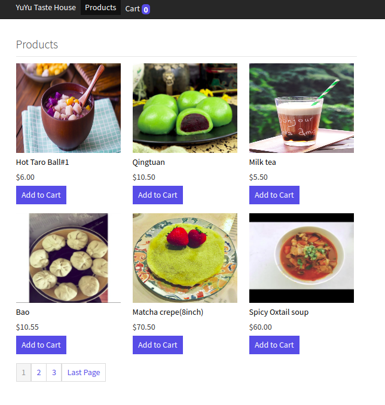
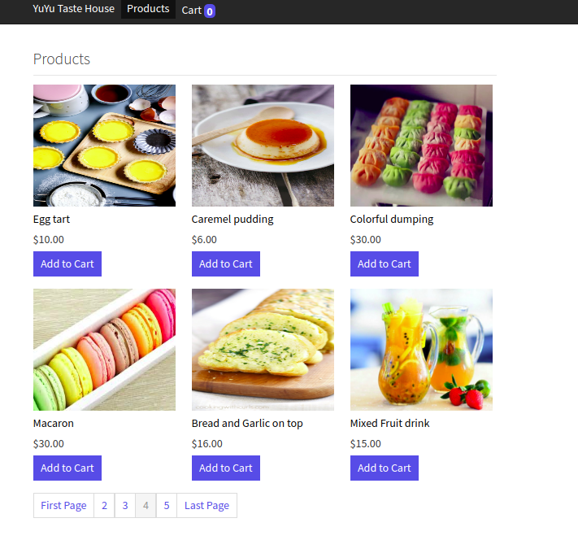
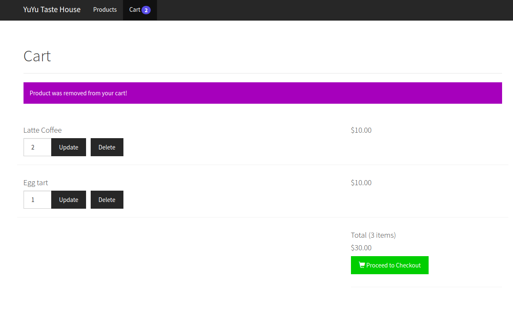
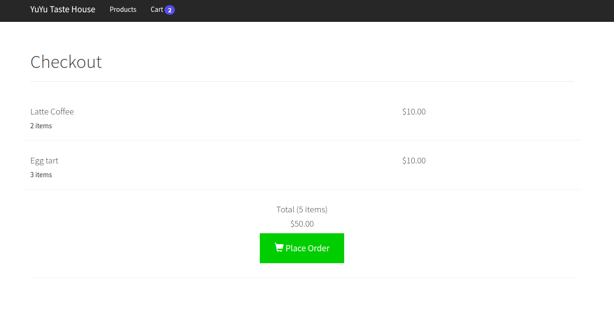
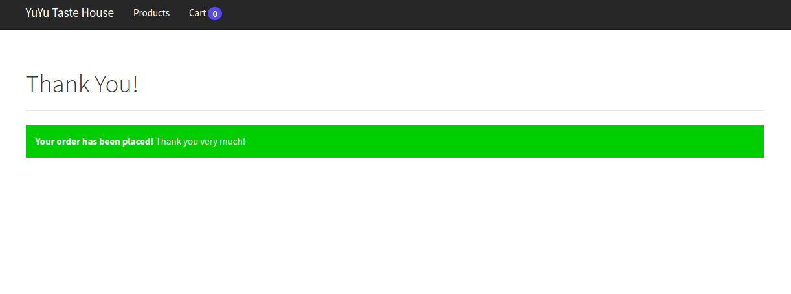

# Basic E-Commerce website(include products show, cart, checkout)
Use boostrap,jQuery, php, mySQl.
[CSS CLASS](https://www.agewellglobal.com/helper-classes)
 know m-b-20px m-t-0px  

## File structure and roles
### Layout
1.layout_head.php 
$SESSION['cart']  html $page_title  

2.layout_foot.php 
html customized-js(class:update-quantity-form, class:product-id, class:cart-quantity 

3.navigation.php 
user_id count()  

### Display products
1.products.php 
Define $db, $page_title, $product, $product_image, $cart_item, $action, $page, 
$records_per_page, $from_record_num, $page_url, $total_rows  
call function: read($from_record_num, $records_per_page),  rowCount(), count()  

2.objects/product.php 
Implement read($from_records_num, $records_per_page), count(), readByIds($ids) <nr />

3.objects/product_image.php 
Implement readFirst() 

4.read_products_temp.php 
class:m-b-20px  product-id  product-link m-b-10px w-100-pct product-name w-1-pct 
$product_image  product_id  $id user_id  $cart_tiem  
call readFirst()  

5.pagination.php 
class:col-md-12 pagination(bootstrap) m-b-20px m-t-0px  
Define $cart_count $total_pages  $range  $page_url  $page 

### Cart
1.add_to_cart.php 
$cart_item  user_id  product_id  $product_id  quantity $quantity  
call exists() create()  
Action: added  exists unable_to_add 

2.objects/cart_item.php 
Implement exists() count()  create()  read()  update() delete()  deleteByUser()     

3.remove_from_cart.php 
Define $product_id($GET['id'] 
Action:removed  

4.update_quantity.php 
Define $product_id($GET)  $quantity($GET)  
Call $cart_item  update()  
Action:updated unable_to_update 

5.cart.php 
show all action results  
call $cart_count 
class:cart-row  product-name  update-quantity-form  product-id  input-group  cart-quantity  input-group-btn  update-quantity  
!!!update quantity: class is 'update-quantity-form will trigger layout_foot.php javascript $(document).ready function  

### Checkout
1.checkout.php 
$page_title  
call $cart_count  $quantity  
Define $total $item_count  $sub_total   
class: cart-row  

2.place_order.php 

#### tutorial is here!!
https://www.codeofaninja.com/2013/04/shopping-cart-in-php.html
